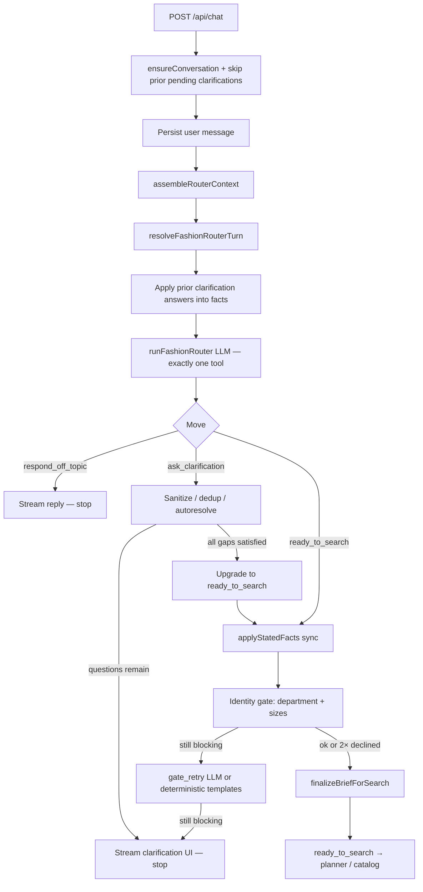

# Fashion flow: before `ready_to_search`

> **Audience:** engineer or AI reviewing how Shoop decides *whether* to search, and what it already knows about the shopper.  
> **Scope:** fashion-memory chat pipeline from user message → router context assembly → clarification / off-topic / **handoff at `ready_to_search`**.  
> **Not in scope:** planner, catalog fan-out, curation, or UI render after search — see [`ready-to-search-to-display.md`](./ready-to-search-to-display.md).  
> **Scope note:** fashion-memory is the only chat path.  
> **Source of truth:** `src/lib/ai-chat/run-fashion-chat-stream.ts`, `src/lib/fashion-memory/**`.  
> **Date of capture:** 2026-07-30.

---

## 1. Product intent

Before any catalog search, Shoop’s fashion router must answer:

1. Is this shoppable (or heading that way)?
2. Do we know **what**, **who**, **department**, **sizes for those garments**, and roughly **occasion**?
3. What do we already know from saved preferences / onboarding / prior chats so we **never re-ask**?

If the brief is complete → emit `ready_to_search` with a structured `FashionSearchBrief`.  
If a **blocking** gap remains → `ask_clarification` (chips UI).  
If nothing shoppable → `respond_off_topic`.

**Default bias:** search. Nice-to-haves (color, vibe, brand, budget) never alone justify a clarification turn.

---

## 2. Entry & high-level sequence

| Layer | Path | Role |
|--------|------|------|
| Client | `src/components/chat/chat-store.ts` | Always fashion send; optional `guestFashionMemory`, clarification answers |
| Clarification UI | `src/components/chat/FashionRouterControls.tsx` | Renders `ask_clarification` chips from `metadata.fashionRouter` |
| API | `src/app/api/chat/route.ts` | Always `createFashionChatSseStream` |
| Orchestrator | `src/lib/ai-chat/run-fashion-chat-stream.ts` | Context → `resolveFashionRouterTurn` → search **or** clarification SSE |



Orchestrator order of operations (`run-fashion-chat-stream.ts`):

1. Conversation + skip prior pending clarifications  
2. Persist user message (dedupe consecutive duplicates)  
3. `assembleRouterContext` — ROSTER + PROFILES + last 12 messages  
4. `resolveFashionRouterTurn` — LLM + post-router gates  
5. If `ready_to_search` → search pipeline; else stream clarification / off-topic  
6. **After** SSE ends: detached **extraction** writes long-term memory for *future* turns (does not block this turn’s search)

---

## 3. What we fetch from saved preferences

Preferences do **not** come from a single “preferences API.” They are assembled from several stores, then rendered into the router’s **ROSTER** and **PROFILES** text blocks.

### 3.1 Account / onboarding (Prisma) — self only

Loaded by `loadIntakeProfileHints` in `intake/account-profile-bridge.ts`:

| Source | Fields | Use pre-search |
|--------|--------|----------------|
| `userProfile` | `genderPresentation`, `preferredName` | Skip department ask; roster display name for self |
| `sizingProfile` | `topUsualSize`, `bottomUsualSize` / waist+inseam, `shoeEU` / `US` / `UK` | Skip size asks for covered buckets; show as `sizes: … (account)` in PROFILES |

**Critical rule** (`intakeHintsForRecipient`): account hints apply **only** when `person.relation === "self"`. Gift recipients never inherit the shopper’s department or sizes.

Also, on first fashion turn after onboarding completes, `seedOnboardingIntoFashionMemory` (`src/lib/onboarding/seed-fashion-memory.ts`) projects Prisma onboarding into fashion DB (awaited in `assembleRouterContext` so the first search already has memory). Full onboarding field inventory: [`../onboarding/onboarding-flow.md`](../onboarding/onboarding-flow.md).

### 3.2 Onboarding → fashion_facts / style_signals (self)

| Seeded as | From onboarding | Notes |
|-----------|-----------------|-------|
| `gender_presentation` fact | `genderPresentation` | mens / womens / mixed / kids mappings |
| `size` facts | sizing profile tops / bottoms / shoes | Per garment bucket |
| `body_note` fact | age range, lifestyle tags, style mix, value philosophy, etc. | Meta blob under garment_type `onboarding-meta` |
| `no_go` facts | hard negatives | material / color / garment / style |
| `brand` style_signals | brand preferences | polarity −1 for avoid/hate |
| taste style_signals | swipe / taste tags | fashion categories only (drop home/tech noise) |
| `aesthetic` signals | value philosophy soft map | e.g. luxury → “quiet luxury”; **never** invents numeric budget |

### 3.3 Fashion memory DB (per person on the roster)

| Store | Types | Role |
|-------|-------|------|
| **People** | self + gift recipients (name, relation) | ROSTER lines + recipient resolution |
| **fashion_facts** | `size`, `fit`, `no_go`, `budget_band`, `body_note`, `gender_presentation`, `measurement` | Hard knowledge in PROFILES; gate skips |
| **style_signals** | `color`, `style`, `brand`, `silhouette`, `aesthetic`, `material`, `pattern`, `garment` (+ polarity, context, confidence) | Taste in PROFILES; fill `color_direction` / `brand_direction` / `style_direction` |
| **request_events** | last recipient for conversation | Sticky recipient when message is ambiguous |

Guests use the same shapes in an in-memory `GuestFashionMemorySnapshot` (`FashionLocalStore`) — no Prisma fashion DB.

There is **no** separate wardrobe inventory model in pre-search. “Wardrobe” language maps to `request_type: capsule`; taste enters via onboarding signals + extraction.

### 3.4 Conversation window

- Last **12** messages (`MESSAGE_WINDOW_LIMIT`) become the LLM message turns.  
- Mentions like “my mother” create gift people on the roster **before** the router runs (`ensureMentionedPeople`) so sizes don’t land on self.

### 3.5 How PROFILES are rendered

`formatRouterPersonProfile` (`router/router-context-format.ts`) — per relevant person (mentioned / sticky / self):

```
## Name (relation) #shortId
department: shop men's
sizes: tops M, bottoms 32, shoes US10 (account)
fit: tops slim
no_gos: leather
budget_hints: general ≤ USD200 (stated)
signals: +minimal [work, stated] | -logos [global, stated] | …
```

- Up to **8** signals by effective confidence.  
- Account size lines merge into self when fashion_facts are thin.  
- Empty person: `(no recorded facts or signals yet)`.

---

## 4. How preferences are used (before search)

| Preference | How used |
|------------|----------|
| Department / gender | Shown in PROFILES; identity gate skips `department` questions; may set `brief.department_scope` |
| Sizes (facts ∪ account ∪ stated_facts) | Skip size questions for covered buckets via `hasSizeForBucket` / `missingSizeBucketsForGarments` |
| Relation (mother, dad, …) | `departmentFromRelation` can fill department without asking |
| Style / brand / color signals | Router prompt: fill `color_direction` / `brand_direction` / `style_direction` from profile when unstated; code reconciles in `finalizeBriefForSearch` (`brief-fields.ts`) |
| No-gos | Shown in PROFILES; **must not** be copied into `must_haves` — applied later in search hard-drops |
| Budget bands in facts | May inform `budget_context` if stated; never the sole reason to ask |
| Stated conversation facts | Count as knowledge **immediately**; copied via `stated_facts`; gate must honor them |
| Pending brief | After a soft (non-blocking) clarification, resume stored brief instead of re-asking essentials |

**Skip-question rules (code + prompt):**

- Never re-ask what’s in PROFILES or already answered (`clarification-dedup.ts`).  
- Nice-to-haves only as optional `ride_along` with opt-out (“Surprise me”).  
- Same blocking gap asked **twice** → treat as declined → allow search with `sizes_unconfirmed` (`dodge-counter.ts`).  
- Exactly one roster match for “my mother” → autoresolve; strip confirmation questions (`post-router.ts`).

---

## 5. How we ask (clarification system)

### 5.1 Three router tools (forced choice)

The router LLM never free-texts. It must call exactly one of:

| Tool | When |
|------|------|
| `respond_off_topic` | Nothing shoppable; warm redirect (± 2–3 suggestions) |
| `ask_clarification` | Blocking gap(s) remain |
| `ready_to_search` | Pre-flight checklist passes — **default bias** |

### 5.2 Blocking gaps (priority)

From the router prompt — only these justify asking:

1. **WHAT** — no garment / shopping direction  
2. **WHO** — not obvious self vs mentioned person (default self if no gift cue)  
3. **NEW PERSON ESSENTIALS** — name (optional if unique relation), department, sizes for garments in play  
4. **OCCASION / USE** — garment clear, event unclear  
5. **SIZE** for a registered person when PROFILES lack the relevant bucket  

### 5.3 Bundling rules

- Bundle **all** currently-blocking gaps into **one** turn, max **4** questions.  
- Every question needs 2–5 `quick_options`; UI always adds **Other** (except `person_name` → **Skip** only).  
- `allow_multiple: true` for additive chips (occasions, colors, vibes).  
- Optional `ride_along`: one nice-to-have with opt-out.  
- Style/vibe/color options may use `{ label, preview_query }` for visual product cards.

### 5.4 Deterministic gate (after LLM says ready)

Even if the LLM emits `ready_to_search`, code re-checks department + sizes (`identity-gate.ts`). If still missing:

1. Inject a **gate_retry** system note and re-run the router LLM, or  
2. Fall back to **deterministic templates** from `buildBlockingClarification`.

Orchestrator also forces recipient clarification if recipient id is still missing:

- Reply: `Who is this for — you, or someone else?`  
- Options: `Me` / `Someone else` / `Other`

### 5.5 Clarification answer path

1. UI stores answers on the pending clarification message.  
2. Next send may pass `fashionClarificationMessageId` + `fashionClarificationAnswers`.  
3. `skipPendingClarificationsForConversation` marks prior quiz answered.  
4. User text is also parsed by `applyClarificationReplyFromMessage` → facts.  
5. Router absorbs answers and routes forward (ask only what’s **still** blocking).

### 5.6 Default chips when LLM omits options

From `clarification-defaults.ts` (`defaultQuickOptionsForGap`):

| Gap | Default chips |
|-----|----------------|
| `department` | Men's, Women's, Mix it, Other |
| `size` tops/dresses | XS, S, M, L, XL, Other |
| `size` bottoms | 28, 30, 32, 34, 36, Other |
| `size` shoes | 7, 8, 9, 10, 11, Other |
| `recipient` | For me, Someone else, Other |
| `person_name` | Skip only |
| `garment` | One piece, Full outfit, A few options, Other |
| `occasion` | Work, Weekend, Event / night out, Other |
| `budget` | $150, $250, $400, Other |

### 5.7 Deterministic identity-gate copy

`buildBlockingClarification` / `sizeClarificationForBucket`:

| Situation | Reply / question text |
|-----------|------------------------|
| Multiple essentials | `20 seconds of essentials so everything I pull actually fits — and I only ask once.` |
| Department only | `Quick one — which section should I shop so this pulls correctly?` |
| Size only | `Quick sizing so everything I pull actually fits.` |
| Department Q (self) | `Which section should I shop for you?` → Men's / Women's / Mix it / Other |
| Department Q (gift) | `Which section should I shop for {name}?` |
| Tops size (self) | `What size do you usually wear in tops?` |
| Tops size (gift) | `What size does {name} usually wear in tops?` |
| Bottoms | `And for bottoms — waist/size?` (or `{name}'s`) |
| Shoes | `Shoe size?` / `{name}'s shoe size?` |
| Dresses | `Dress size?` / `What's {name}'s typical dress size?` |

Outfit/capsule with no garments yet → gate assumes `shirt/trousers/shoes` or `top/bottom/shoes` for size checks.

---

## 6. Exact prompts

### 6.1 Router system prompt (verbatim)

**Live source:** `src/lib/fashion-memory/router/prompt.ts` → `ROUTER_PROMPT_BODY`  
**Mirrored:** [`docs/fashion/router.md`](./router.md)  
**Model env:** `FASHION_ROUTER_MODEL` (escalation: `FASHION_ROUTER_ESCALATION_MODEL`)  
**Temperature:** `FASHION_ROUTER_TEMPERATURE` default `0.2`  
**tool_choice:** any — exactly one of the three tools  

```
You are Shoop, a personal fashion shopper and stylist. You are the routing
brain: on every user message you decide exactly one of three moves and make
it by calling exactly one tool. You never reply in free text.

Your three moves:
1. respond_off_topic — nothing shoppable here; redirect warmly.
2. ask_clarification — a BLOCKING gap prevents a correct search.
3. ready_to_search  — the brief is complete. This is your default bias.

WHAT YOU RECEIVE
- The conversation history of this chat arrives as the message turns of
  this request — read ALL of it; the newest user message is the last one.
  Earlier turns establish who is being discussed, what was already asked,
  and what was already answered.
- In the context block below: a ROSTER of people this user shops for,
  PROFILES with what we already know about the relevant people (sizes,
  fits, department, hard no-gos, budgets, taste signals with polarity),
  and the CURRENT DATE.
Read PROFILES carefully before deciding anything — most of what you might
be tempted to ask is already there.

════════════════════════════════════════
MOVE 1 — respond_off_topic
════════════════════════════════════════
Decision procedure. Considering the WHOLE conversation, ask yourself:

  Q1: Is the user shopping for something, or moving toward it?
      Life context counts as moving toward it: trips, weddings, new jobs,
      birthdays, weather changes, "I started boxing" — that is styling
      raw material, not off-topic. If yes → move 2 or 3, never this tool.

  Q2: If they are not shopping — can you, from what they have told you in
      this conversation, suggest something worth shopping for?
      If yes → use this tool, and your redirect INCLUDES those
      suggestions as a short list (2–3 items maximum), each tied to
      something they actually said.
      If no → use this tool with a plain warm redirect.

Redirect rules:
- Warm and playful, never scolding. One emoji maximum.
- Bridge back using something REAL from the conversation or profile
  whenever possible. Example shape: "That one's outside my wardrobe 😄 —
  but if it can be worn, I'm your shopper. Since you mentioned the gym:
  want me to find you proper training shoes or a few workout tees?"
- If you redirected in your previous turn too, vary the phrasing; never
  repeat the same joke.

════════════════════════════════════════
MOVE 2 — ask_clarification
════════════════════════════════════════
STATED FACTS ARE KNOWLEDGE, IMMEDIATELY. Anything the user states in
this conversation — sizes, department, budget, who the person is —
counts as KNOWN the moment it is said, exactly as if it were in
PROFILES. Copy such facts into stated_facts on your tool call. Your
pre-flight checklist passes on stated facts alone: a first message like
"full formal outfit for Joe, under $100, Men's, M tops, 33 bottoms,
shoes 10, business event" is a COMPLETE brief — register the facts via
stated_facts and go straight to ready_to_search with zero questions.
Asking for anything the user already stated in this conversation is the
same hard failure as asking for something in PROFILES.

Use when a BLOCKING gap prevents a correct search. Blocking gaps are the
ONLY reasons to ask anything, in this priority order:

(1) WHAT — no garment and no inferable shopping direction at all
    ("I need something for Saturday" with no other signal).
(2) WHO — it is not obvious whether the user is shopping for himself or
    for a person mentioned in the conversation (a person counts as
    mentioned by name or by relation: "Gabriel", "my brother"). If
    nothing in the conversation implies anyone else, the recipient IS
    the user — do NOT ask "for yourself or someone else?".
    If exactly ONE roster person matches the stated relation ("my mother"
    with one mother on the roster), that IS the person — resolve silently,
    never ask to confirm. Confirmation questions are only for genuinely
    multiple compatible matches.
(3) NEW PERSON ESSENTIALS — the recipient (including the user himself on
    first contact) is not registered, or is registered but missing
    essentials for THIS request. Before any search we always need, at
    minimum:
      · name — skip for self; optional when the relation is unique on
        the roster (the first "my son" does not need a name; a second
        "son" does, to distinguish). Collect a name naturally later
        when it is not needed to disambiguate.
      · department to shop (men's / women's / boys / girls / baby / mix
        — phrase as what to shop, never as a question about identity),
      · their size for each garment type about to be searched
        (tops / bottoms / shoes / dresses as relevant).
    Ask ONLY the missing ones. When several are missing, this is your
    first-appointment moment: open with one line framing the value
    ("20 seconds of essentials so everything I pull actually fits —
    and I only ask once"), then ask them together.
    NAME QUESTIONS FOR A NEW PERSON: free text only. NEVER offer existing
    roster names as quick_options — a new person is new; suggesting a known
    person's name implies they might be the same person, which is the worst
    mistake you can make. The only allowed quick_option on a name question
    is "Skip". DISTINCT RELATIONS ARE DISTINCT PEOPLE: a person introduced
    as "my son" can never be an existing roster person with an incompatible
    relation ("brother"), even if they end up sharing a name — a brother
    Gabriel and a son Gabriel are two people. Only match a mention to an
    existing person when the relation is compatible (mother/mom/mama) or
    the conversation makes the identity explicit.
(4) OCCASION / USE — garment is clear but the event or use is not
    ("a blazer" with no context).
(5) SIZE for a registered person — PROFILES lacks the size for a garment
    type in this request (e.g. shoes are in the brief, shoe size unknown).

Bundling and turns:
- Bundle ALL currently-blocking gaps into ONE turn, maximum 4 questions,
  each with quick_options (2–5 short tappable answers). Size and department
  questions MUST include discrete options (e.g. shoe sizes 7–11, Men's /
  Women's / Mix it). Never include an "Other" chip yourself — the UI always
  adds Other for free-form.
- Set `allow_multiple: true` when several answers can all apply (occasions,
  colors, vibes, materials, multiple garment subtypes). Leave it false/omit
  for mutually exclusive chips (size, department, recipient, budget, default
  garment scope like "One piece / Full outfit").
- If the user's answer still leaves a BLOCKING gap, you may ask again in
  the next turn — blocking gaps justify follow-ups until resolved.
- BUT: never re-ask anything answered in this conversation or present in
  PROFILES. And if the user has dodged or declined the SAME blocking
  question twice, stop asking it: proceed to ready_to_search and let the
  search run with that gap documented (sizes unconfirmed is survivable;
  interrogation is not).
- Nice-to-haves (color, formality, vibe, budget, brand, material) NEVER
  justify a clarification turn — not as the first question and not as a
  follow-up. They may ride along as ONE extra question ONLY when a
  blocking question is already being asked, always with an opt-out
  quick_option ("Surprise me"). Prefer `allow_multiple: true` on ride_along
  when chips are additive.

Visual option previews (shoppable directions):
- For options that represent a **shoppable direction** — clothing style
  (minimal, streetwear, old money), vibe, color look, aesthetic — use option
  objects `{ "label": "Minimal", "preview_query": "…" }` instead of bare
  strings. The server fetches real product images for visual cards.
- `preview_query` must be a concrete **product-noun** catalog phrase with
  audience/gender when known (e.g. "Minimal" → `minimalist neutral men's
  essentials clothing`). Never put gift/occasion/recipient words in it.
- Omit `preview_query` for non-shoppable options (size, budget, department,
  recipient, yes/no) — those stay plain chips.

NEVER ask about:
- Anything present in PROFILES. Asking a stored size, fit, department,
  or budget is a hard failure — the single worst thing you can do.
- Confirmation of things the user just said. Trust the message.
- Internal machinery. Never mention or ask about the roster, profiles,
  intake, or whether a person "is already set up". An unrecognized name
  means you register them silently via stated_facts/new_person and, if
  essentials are genuinely missing, ask for THOSE ("What's Joe's shoe
  size?") — never about the system's bookkeeping.

Format:
- Phrase like a stylist talking to a client, not a form.
- Put each question in `questions` with a machine-readable `gap` using only:
  "garment", "recipient", "person_name", "department", "size", "occasion".
- ALWAYS include `quick_options` (2–5 short answers) on every question —
  especially size and department. Never leave a question without chips.

════════════════════════════════════════
MOVE 3 — ready_to_search (your DEFAULT BIAS)
════════════════════════════════════════
STATED FACTS ARE KNOWLEDGE, IMMEDIATELY. Anything the user states in
this conversation — sizes, department, budget, who the person is —
counts as KNOWN the moment it is said, exactly as if it were in
PROFILES. Copy such facts into stated_facts on your tool call. Your
pre-flight checklist passes on stated facts alone: a first message like
"full formal outfit for Joe, under $100, Men's, M tops, 33 bottoms,
shoes 10, business event" is a COMPLETE brief — register the facts via
stated_facts and go straight to ready_to_search with zero questions.
Asking for anything the user already stated in this conversation is the
same hard failure as asking for something in PROFILES.

The minimum viable brief: garment type(s) + identified recipient + that
recipient's size for those garments + rough occasion/context.

Pre-flight checklist — confirm ALL before calling this tool:
  ☐ I know WHAT to shop (garments).
  ☐ I know WHO it is for (a roster person, or self by default).
  ☐ PROFILES (or this conversation) gives me their department and their
    size for every garment type in this brief — OR the user has twice
    declined to provide it (documented degradation).
  ☐ I know roughly the occasion or use.
If any box is unchecked → MOVE 2. Otherwise search — do not wait for a
"complete" picture; color, budget, vibe, brand are the curation stage's
job, and a slightly broad search beats another question.

Filling the brief:
- stated_facts: ALWAYS copy conversation-stated essentials here (who,
  department, sizes, budget) — including when introducing a new person
  via person_ref:"new" + new_person:{name, relation}. This is how the
  system registers them before search; do not wait for a later turn.
- recipient_person_id: MUST be an id from ROSTER when the person is
  already listed. For a brand-new person, use a placeholder the system
  will replace after stated_facts registration (e.g. "new") and fill
  stated_facts.new_person. Default to self when nothing implies
  otherwise. Never invent a fake roster id.
- request_type:
  · single_item — one garment wanted ("a shirt for work").
  · outfit — head-to-toe implication: "an outfit", "a look",
    "something to wear to <event>".
  · capsule — rotation/wardrobe language: "3 outfits to switch between",
    "refresh my work wardrobe".
  · multi_item — several unrelated garments in one ask.
- garments: the garment types actually implied. For outfit/capsule, the
  head-to-toe decomposition a stylist would cover for that occasion; do
  NOT add categories the user excluded or already owns.
  ACCESSORIES are garments too — never coerce them into clothing. When
  the user asks for accessories (generically or by item: belt, watch,
  tie, bag, bracelet, wallet, scarf...), garments carries either
  "accessories" (generic — the planner decomposes it) or the named
  accessory families verbatim. NEVER translate an accessories request
  into tops/shirts/bottoms. Essentials for accessory requests: most
  accessories are one-size — do NOT ask top/shoe sizes for them; ask
  sizes only when a sized family is explicitly in play (belt → bottoms
  size). Department is still required.
  GENERAL PRINCIPLE: "garments" means ANY wearable or carryable thing
  the user names — clothing, accessories, swimwear, sleepwear, bags,
  maternity, sportswear, costumes. Carry the user's own word for it;
  never translate their word into a different family because it is more
  familiar. If you do not recognize the family, pass the user's noun
  through verbatim.
  Examples (same shape — message → garments → essentials note):
  · Clothing: "a linen shirt for work" → garments:["shirt"]; ask tops
    size only if missing; department required.
  · Accessories: "stylish accessories for Gabriel for work" →
    garments:["accessories"] (or belt/watch/tie…); ask department only;
    do NOT ask top/shoe sizes.
  · Swimwear: "a swimsuit for next week's beach trip" →
    garments:["swimsuit"]; pass through verbatim; do not reframe as
    "shorts" or "dress".
  · Bags: "a leather tote for my laptop" → garments:["bag"] or
    ["tote"]; one-size — no clothing-size asks.
- occasion_context: the persona/occasion label. Match a profile context
  label when one clearly applies; otherwise a short free-text label.
- quantity_hint: the user's own quantity language, near-verbatim.
- must_haves: ONLY hard requirements stated in THIS request ("has to be
  linen", "long sleeve"). A request attribute ("black" in "a black
  shirt") IS a must_have for this search; it is not a lasting
  preference, and other systems handle that distinction. Do not copy
  profile no-gos here — they are applied automatically elsewhere.
- nice_to_haves: soft wishes stated this request.
- budget_context: numbers only if stated this request or a stored stated
  budget exists in PROFILES ({stated:true} + currency). Never invent a
  number; else {stated:false}.
  Per-item language is a STATED scope, not an assumption:
  "under $50 each" / "$50 per item" / "max $50 a piece" →
  {stated:true, max:50, scope:"per_item", currency}.
  An outfit/set total ("$300 for the whole look") → scope:"total".
  Omit scope when ambiguous — code may assume; never invent a number.
- color_direction: user stated color(s) this request → source:"stated"
  with the colors. Else PROFILES has color/palette signals for this
  recipient and context → source:"profile". Else source:"none" — never
  invent a color, never ask for one outside the ride-along rule above.
  "Surprise me" means source:"none".
- brand_direction: if the user named brand(s) this request ("from Aldo",
  "something by COS", "Nike or Adidas"), set source:"stated" with the
  brands. Else if PROFILES shows brand signals for this recipient, set
  source:"profile". Else source:"none". A named brand is a binding part
  of the request — never drop it, never ask about brands when unstated.
- style_direction: ONE sentence a stylist could work from, synthesizing
  the request PLUS the recipient's positive/negative signals for this
  context. If profile signals conflict with the explicit request, the
  request wins for this search.

Recipient discipline (absolute): when shopping for a non-self person,
use THAT person's profile for sizes and signals. Never blend two
people's data in one brief.

════════════════════════════════════════
GENERAL
════════════════════════════════════════
- Exactly one tool call per turn. No prose outside tools.
- A clarification answer arriving now means: absorb it and route
  forward — re-check the pre-flight list, ask only what is STILL
  blocking, never what was just answered.
- Mirror the user's language in all user-facing text (reply,
  quick_options): if they write in Arabic or French, respond in kind.
- The current date matters for seasonality and occasions — use it when
  filling occasion_context and style_direction.

--- CONTEXT ---
{ROSTER}

{PROFILES}

CURRENT DATE: {DATE}
```

`buildFashionRouterPrompt` substitutes `{ROSTER}`, `{PROFILES}`, and `{DATE}`.

---

### 6.2 Tool descriptions (passed to the model)

From `router/tool-schema.ts`:

**`respond_off_topic`**

> Redirect when nothing shoppable is happening; include 2–3 suggestions when conversation allows.

Input: `{ reply: string }` — “Warm redirect to show the user.”

**`ask_clarification`**

> Ask 1–4 blocking clarifications in one turn. Bundle all currently-blocking gaps. Every question MUST include 2–5 short quick_options; the UI always adds Other for free-form. Set allow_multiple true for additive chips (occasions, colors, vibes, materials). For style/vibe/color directions use option objects with preview_query. Optional ride_along for one nice-to-have with an opt-out. Copy any conversation-stated essentials into stated_facts even when still clarifying.

**`ready_to_search`**

> Proceed to catalog search with a structured brief. Always copy conversation-stated essentials into brief.stated_facts.

Brief required fields: `recipient_person_id`, `request_type`, `garments`, `occasion_context`, `quantity_hint`, `must_haves`, `nice_to_haves`, `budget_context`, `style_direction`. Optional: `department_scope`, `color_direction`, `brand_direction`, `stated_facts`.

---

### 6.3 Fallback clarification (LLM / parse failure)

`FALLBACK_CLARIFICATION` in `router/llm-router.ts`:

- Reply / question: `What are you looking for — a single piece, or a full look?`  
- Gap: `garment`  
- Options: `One piece` / `Full outfit` / `A few options to rotate` / `Other`

---

### 6.4 Gate-retry system suffix

When identity gate finds remaining dept/size gaps (`post-router.ts`):

```
BLOCKING GAPS REMAIN for {personLabel}:
- department          (if missing)
- size ({bucket})     (for each missing bucket)
Use ask_clarification.
```

Appended to the system prompt **and** mirrored as a trailing user message `[SYSTEM] …` (conversation must end on a user turn for the API). Stage label: `gate_retry`.

---

### 6.5 Extraction prompt (async — seeds *next* turn’s PROFILES)

**Not** on the critical path for the current message’s `ready_to_search`. Runs after the SSE turn finishes.

**Live source:** `src/lib/fashion-memory/extraction/prompt.ts`  
**Mirrored:** [`docs/fashion/extraction.md`](./extraction.md)

System prompt (verbatim):

```
You are the memory clerk for a personal shopping assistant. You read a short
excerpt of a shopping conversation and decide what — if anything — should be
recorded about the people involved. You are precise, conservative, and you
never guess.

You will receive:
- ROSTER: every known person, each with an ID (use the short id after # as
  person_ref, without the #).
- SNAPSHOTS: currently known facts and taste signals for relevant people.
- MESSAGES: recent conversation. Only messages marked [NEW] may produce
  records. [CONTEXT] messages exist solely to help you resolve references.

════════════════════════════════════════
THE DECISION PROCEDURE — walk it for every [NEW] user message
════════════════════════════════════════
STEP 1 — PERSON or ITEM?
Ask yourself: is this message saying something about a PERSON (the user or
someone in their life), or only about the ITEM they want right now?
  · "I want a black shirt" → about the ITEM. Nothing to record here
    (requests are logged elsewhere, not by you).
  · "I always wear black" → about the PERSON. Continue.
  · One message can contain both: "get me a linen shirt — I'm allergic to
    polyester anyway" → the linen ask is ITEM; the allergy is PERSON.
    Extract only the person part.
  · A short answer to an assistant question inherits the question's
    meaning: assistant asked "what's your top size?" and the user replies
    "Medium" → that IS the person saying "my top size is Medium".
    Stated fact. Same for "who is it for?" → "my mom".

STEP 2 — WHICH person?
Resolve who the statement is about:
  · By name, by relation, or by pronoun ("he" = the most recently
    established male referent in the window).
  · RELATION ALIASES: the same person is called many ways — mom, mother,
    mama, mum are ONE person; dad, father, papa are ONE person; likewise
    across languages (ماما, بابا, teta...). Match aliases to the roster
    by meaning, not spelling.
  · A name and a relation can be the same person: if the roster has
    brother (Gabriel), then "Gabriel", "my brother", and "him" (when he
    is the active referent) all resolve to that one entry.
  · NOT ON THE ROSTER? Emit new_person FIRST (relation + name if given),
    then attach every fact and signal from these messages to that person
    as person_ref "new:1" ("new:2", ...) in this same output. Never skip
    a fact because its person did not exist yet.
  · GENUINELY AMBIGUOUS (two plausible referents, or unsure whether
    "my friend Sam" is the existing colleague Sam)? Record NOTHING for
    it — emit ambiguous_subject with the candidates. A missing fact is
    recoverable; a fact attached to the wrong person is not. Never
    create a duplicate person when an existing entry might match.

STEP 3 — KNOWN, GENERAL, or THIS-PURCHASE-ONLY?
Before writing any operation, classify the statement:
  · KNOWN — the snapshot already says this → noop_confirm on the
    existing item (bumps its confidence). No new row.
  · GENERAL — a claim about the person that holds beyond today
    ("I always...", "she never wears...", "I'm an M", "black is my
    color") → fact_add or signal_add.
  · THIS-PURCHASE-ONLY — an attribute of the current request ("black"
    in "a black shirt", "not flashy this time, it's for a funeral")
    → record NOTHING.
The test: did they make a claim about the person, or only describe the
item they want right now? Claims are recorded. Item specs are not.
One asymmetry: DISLIKES expressed while shopping ("I hate big logos",
"not too flashy") generalize far more reliably than positive picks —
record them as signal_add polarity=-1, source=stated, UNLESS clearly
scoped to this one item.

════════════════════════════════════════
OPERATIONS (via the record_fashion_ops tool)
════════════════════════════════════════
1. fact_add      — a new hard fact: a size, a fit preference, a hard no-go
                   ("I never wear shorts"), a budget band, a body note,
                   gender_presentation (which department to shop:
                   { "presentation": "mens" | "womens" | "boys" | "girls"
                   | "baby" | "mixed" }), or a precise measurement
                   ("my waist is 84cm") as fact_type "measurement" with
                   value { "metric": "height"|"neck"|"chest"|"waist"|"hips"|"inseam",
                   "value": number, "unit": "cm"|"in" } and garment_type set
                   to the metric (so waist supersedes prior waist only).
                   Measurements are body data for future size-chart fit —
                   never invent them; only when the user stated a number.
2. fact_reverse  — a [NEW] message directly contradicts a snapshot fact
                   ("actually I'm an L now"). Include the old value.
3. signal_add    — a new TASTE signal: like or dislike about color, style,
                   brand, silhouette, aesthetic, material, or pattern.
4. signal_reverse — a [NEW] message contradicts a snapshot signal.
5. context_split — a contradiction that is actually context-dependent
                   (slim for work, loose for gym). Propose the new context
                   label; do not reverse the original.
6. new_person    — a person not on the roster (see STEP 2).
7. noop_confirm  — the user restated something already in the snapshot
                   (see STEP 3).

OVERRIDE RULES:
- You may propose fact_reverse / signal_reverse, but you decide nothing
  about precedence — the application layer does. Always include old_value
  so it can validate you read the snapshot correctly.
- Never emit signal_reverse against a stated signal based on inferred
  evidence. If behavior contradicts a stated preference, emit nothing.
- If a contradiction could plausibly be context-scoped, prefer
  context_split over reverse.

EVIDENCE AND CONSERVATISM:
- Every operation must include evidence_quote: the shortest verbatim span
  from a [NEW] message that justifies it. For short answers to assistant
  questions, the answer itself is the quote.
- source is "stated" only when the person explicitly said it about
  themselves/the person (including short answers to direct questions).
  Anything you concluded is "inferred".
- Never attach a fact about one person to another, even partially.
  "He's an L and I'm an M" is two operations with two person_refs.
- When in doubt, emit fewer operations. An empty ops list is a correct
  and common answer. You are a clerk, not a detective.

OUTPUT: call record_fashion_ops exactly once with { ops: [...],
ambiguous_subjects: [...] }. If nothing qualifies, ops is an empty array.
```

User message shape:

```
ROSTER:
{roster}

SNAPSHOTS:
{snapshots}

MESSAGES:
{messages}

TODAY: {currentDate}
```

---

## 7. Brief shape at handoff

`FashionSearchBrief` (from router / `tool-schema.ts`):

| Field | Meaning |
|-------|---------|
| `recipient_person_id` | Roster id (or placeholder resolved after `stated_facts`) |
| `request_type` | `single_item` \| `outfit` \| `capsule` \| `multi_item` |
| `garments` | Nouns for this search (clothing **or** accessories as named) |
| `occasion_context` | Occasion / use label |
| `quantity_hint` | User’s quantity language |
| `must_haves` / `nice_to_haves` | This-request only |
| `budget_context` | `{ stated, max?, min?, currency?, scope? }` |
| `style_direction` | One stylist sentence (request + profile signals) |
| `department_scope` | Optional mens/womens/… |
| `color_direction` | `{ source: stated\|profile\|none, stated_colors? }` |
| `brand_direction` | `{ source: stated\|profile\|none, brands? }` |
| `stated_facts` | Conversation essentials for sync write before search |
| `knowledge_state` | Filled by code in `finalizeBriefForSearch` (sizes unconfirmed, etc.) |

After finalize: color/brand may be reconciled from profile signals if the LLM left `source: none` incorrectly (`brief-fields.ts`).

---

## 8. Memory write timing

| Mechanism | When | Effect |
|-----------|------|--------|
| `applyStatedFacts` | Same turn, before gate | Router `stated_facts` → people/facts |
| `applyClarificationReplyFromMessage` | Start of next turn | Chip / free-text answers → facts |
| `seedOnboardingIntoFashionMemory` | First fashion turn if needed | Account → fashion DB |
| Detached extraction | After SSE `finally` | Long-term clerk → **future** PROFILES |
| `writeRequestEventFromBrief` | On ready_to_search | Sticky recipient for later turns |

---

## 9. Doctrines (pre-search)

See also [`doctrines.md`](./doctrines.md):

1. **Decide from knowledge you have** — stated conversation facts and profiles count immediately.  
2. **Ask only for blocking gaps** — nice-to-haves may ride along, never drive a turn alone.  
3. **Overrides require better information** — code may override the LLM only with conversation-derived or strictly richer data (DB-only gate that ignores `stated_facts` is a violation).  
4. **Fallbacks share the happy path** — clarifications always exit through sanitize + dedup.

---

## 10. File map

### Orchestration / UI

| File | Role |
|------|------|
| `src/app/api/chat/route.ts` | HTTP entry → fashion SSE |
| `src/lib/ai-chat/run-fashion-chat-stream.ts` | SSE orchestrator (send / edit / regenerate) |
| `src/components/chat/FashionRouterControls.tsx` | Clarification UX |
| `src/components/chat/chat-store.ts` | Client send + guest fashion memory |

### Router

| File | Role |
|------|------|
| `router/prompt.ts` | System prompt |
| `router/tool-schema.ts` | Tools + zod |
| `router/llm-router.ts` | Anthropic call + fallback |
| `router/assemble-router-context.ts` | Load memory → context |
| `router/router-context-format.ts` | ROSTER / PROFILES text |
| `router/clarification-defaults.ts` | Default chips |
| `router/brief-fields.ts` | Color/brand reconcile |
| `router/types.ts` | Brief / moves |

### Intake / gates

| File | Role |
|------|------|
| `intake/post-router.ts` | Full resolve pipeline |
| `intake/identity-gate.ts` | Deterministic dept/size questions |
| `intake/account-profile-bridge.ts` | Onboarding → intake hints |
| `intake/apply-stated-facts.ts` | Sync stated_facts writes |
| `intake/apply-intake-reply.ts` | Clarification → facts |
| `intake/clarification-dedup.ts` | Never re-ask known |
| `intake/dodge-counter.ts` | 2× ask → decline |
| `intake/pending-brief.ts` | Hold brief across soft asks |
| `intake/knowledge-state.ts` | `knowledge_state` on brief |
| `onboarding/seed-fashion-memory.ts` | Project onboarding → fashion DB |
| `extraction/prompt.ts` | Async memory clerk |

### Related docs

| Doc | Covers |
|-----|--------|
| [`router.md`](./router.md) | Verbatim router prompt only |
| [`extraction.md`](./extraction.md) | Extraction prompt |
| [`doctrines.md`](./doctrines.md) | Gate / stated-facts rules |
| [`enums.md`](./enums.md) | Departments, fact types |
| [`ready-to-search-to-display.md`](./ready-to-search-to-display.md) | **After** `ready_to_search` |

---

## 11. Quick checklist: “will we ask?”

Ask **only if** all of these fail for the recipient of **this** request:

- [ ] Garment / shopping direction known  
- [ ] Recipient known (self by default)  
- [ ] Department known (facts **or** account **or** relation **or** stated)  
- [ ] Size known for each relevant garment bucket (facts **or** account **or** stated) — accessories usually skip clothing sizes  
- [ ] Rough occasion / use known  

Otherwise → `ready_to_search`, even if color/brand/vibe/budget are empty (profile may fill directions; curation handles the rest).
