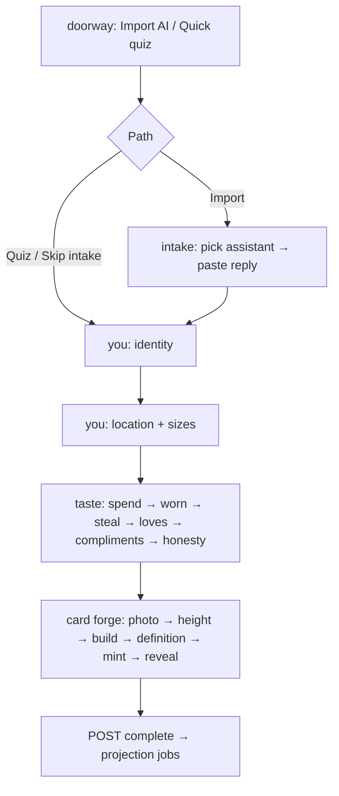

# Onboarding flow: data collected, storage, required vs optional

> **Audience:** engineer or AI reviewing what Shoop learns during onboarding.  
> **Scope:** authenticated modal onboarding (`OnboardingGate`) from doorway → complete, including storage and projection into fashion-memory.  
> **Deep dive on outfit grids only:** [`outfit-grid-wear-steal-logic.md`](./outfit-grid-wear-steal-logic.md).  
> **How onboarding feeds fashion search:** [`../fashion/before-ready-to-search.md`](../fashion/before-ready-to-search.md) §3.  
> **Source of truth:** `src/components/onboarding/OnboardingGate.tsx`, `src/lib/onboarding/**`, `prisma/schema.prisma` (`UserProfile`, `SizingProfile`, …).  
> **Date of capture:** 2026-07-30.

---

## 1. Product intent

Onboarding builds a **typed profile** for the signed-in shopper so fashion chat can skip re-asking department/sizes and personalize taste. The modal stays open until `UserProfile.onboardingCompleted === true`.

**Server completion gate** (hard block on `POST` complete):

| Field | Required to complete? |
|-------|------------------------|
| `preferredName` | **Yes** |
| `genderPresentation` | **Yes** |
| `ageRange` | **Yes** (from DOB or style era) |

Everything else is skippable. Soft UI copy says “Only your name is truly required…” on the identity substep, but leaving the **You** section for taste still requires **name + gender + style era** (which supplies `ageRange` when DOB is skipped).

---

## 2. Flow overview

**UI rail:** Who you are → What's your taste → Your card



| # | Step | Substep | Screen | User-facing title / copy |
|---|------|---------|--------|--------------------------|
| 0 | `doorway` | — | `OnboardingDoorwayStep` | “Two ways in.” — **Import from your AI** \| **Quick quiz** |
| 1a | `intake` | `select` | `AiProfileTransferStep` | Pick assistant |
| 1b | `intake` | `paste` | same | Copy transfer prompt → paste AI reply (**Skip** allowed) |
| 2a | `you` | 0 | `YouIdentityStep` | Name, how you shop, birthday, style era, world |
| 2b | `you` | 1 | `YouLocationSizesStep` | Ship-to country/city/currency + sizes |
| 3a | `taste` | `spend` | `TasteSpendStep` | “How do you like to spend?” |
| 3b | `taste` | `worn` | `TasteOutfitGridStep` | “Which three did you actually wear most this month?” (max **3**) |
| 3c | `taste` | `aspirational` | `TasteOutfitGridStep` | “Whose closet would you steal?” (max **2**) |
| 3d | `taste` | `loves` | `TasteLovesVetoesStep` | “Quick vetoes and loyalties.” |
| 3e | `taste` | `compliments` | `TasteComplimentStep` | “What's the compliment you'd love to hear?” (pick **2**) |
| 3f | `taste` | `honesty` | `TasteHonestyStep` | “how honest do you want me?” |
| 4 | `card` | photo→…→reveal | `CardForgeStep` | Avatar forge (**entirely skippable**) |

Progress milestones: `FLOW_PROGRESS_KEYS` in `OnboardingGate.tsx`.  
Resume: server floor + `sessionStorage` key `shoop.onboarding.ui.v1`.

**Not in live gate (legacy):** `TasteSwipeStep`, `ShoppingCartRevealStep`, `OnboardingProfileStep`.

---

## 3. Required vs optional (at a glance)

### Must have to finish onboarding (server)

`REQUIRED_ONBOARDING_FIELDS` in `status.ts`:

1. `preferredName`  
2. `genderPresentation`  
3. `ageRange`

### Client gate before leaving **You → Taste**

`saveYouAndContinue` also requires:

- Style era selected (maps to `ageRange` if no DOB), **or** DOB that yields age ≥ 13

### Skip anytime (optional)

| Area | Skip behavior |
|------|----------------|
| AI intake | “Skip — I'll fill it in myself” / “Skip for now” |
| Birthday | “Prefer not to say” (`birthDateSkipped`) |
| Lifestyle / world chips | Optional multi-select |
| Country / city / currency / sizes | Footer: skip; sizes copy: “I'll grab them at your first checkout” |
| Entire taste rail substeps | Advance without picks |
| Card forge | “Skip for now” / `onSkipAll` → complete without avatar |

---

## 4. Field inventory

Legend for **Required?**:

- **Server** — blocked if missing on complete  
- **Client You** — blocked before taste  
- **Optional** — skip / empty OK  

### 4.1 Doorway / AI intake

| Field | UI | Values | Required? | Stored where |
|-------|-----|--------|-----------|--------------|
| Path | Import AI / Quick quiz | — | Choose one | UI only |
| `primaryAiAssistant` | ChatGPT, Claude, Gemini, Copilot, Perplexity, Meta AI, Other | `chatgpt` \| `claude` \| `gemini` \| `copilot` \| `perplexity` \| `meta_ai` \| `other` | Optional | `UserProfile.primaryAiAssistant` (saved with You) |
| Intake paste | Free text 3–24k chars | string | Optional (skip) | **Not stored raw.** LLM extract → prefill patch + shopping-memory write |

### 4.2 You — identity

| Field | UI label / copy | Values | Required? | Prisma |
|-------|-----------------|--------|-----------|--------|
| `preferredName` | First name / nickname | string ≤120 | **Server + Client You** | `UserProfile.preferredName` |
| `genderPresentation` | “How do you shop for clothing?” | `masculine`, `feminine`, `androgynous`, `nonbinary`, `prefer not to say` | **Server + Client You** | `UserProfile.genderPresentation` |
| `birthDate` | “When's your birthday?” | `YYYY-MM-DD`; skip = prefer not to say | Optional; if set must be ≥13 | `UserProfile.birthDate` |
| `styleEra` | “Which era is your style living in?” | CSV of era chips (see enums below) | **Client You** (feeds ageRange) | `UserProfile.styleEra` |
| `ageRange` | Derived | `13-17`, `18-24`, `25-34`, `35-44`, `45-54`, `55-64`, `65+` | **Server** | `UserProfile.ageRange` |
| `lifestyleTags` | “What's your world these days?” | `campus_life`, `deep_in_career`, `first_job`, `running_the_show`, `kids_in_the_mix`, `time_is_mine` | Optional | `UserProfile.lifestyleTags` `String[]` |

**Style era → ageRange map** (`form-options.ts`):

| Era value | Label (abbrev.) | → `ageRange` |
|-----------|-----------------|--------------|
| `13_14` | 13–14 · Figuring it out | `13-17` |
| `15_17` | 15–17 · High-school era | `13-17` |
| `18_22` | 18–22 · Campus era | `18-24` |
| `23_29` | 23–29 · First-paycheck era | `25-34` |
| `30s` | 30s · Prime era | `25-34` |
| `40s` | 40s · Power era | `35-44` |
| `50s_60s` | 50s–60s · Refined era | `55-64` |
| `65_plus` | 65+ · Icon era | `65+` |

### 4.3 You — location & sizes

| Field | UI | Values | Required? | Prisma |
|-------|-----|--------|-----------|--------|
| `shippingCountry` / `country` | Country | Shopify country labels | Optional (UI often defaults US) | `UserProfile.shippingCountry`, `country` |
| `city` | City | Curated + custom | Optional (often defaults New York) | `UserProfile.city` |
| `currency` | Currency | USD, EUR, GBP, … | Optional (often USD) | `UserProfile.currency` |
| `topUsualSize` | Top | XXS–3XL or 32–46 | Optional | `SizingProfile.topUsualSize` |
| `bottomUsualSize` | Bottom | Waist / WxL options | Optional | `SizingProfile.bottomUsualSize` |
| `shoeEU` | Shoe | EU 35–54 | Optional | `SizingProfile.shoeEU` |

Save path: `POST /api/onboarding/review` (also `ensureSelfPerson` for fashion roster).

**Schema has more sizing columns** (`heightCm`, waist/inseam split, shoe US/UK, fits, notes, …) that onboarding UI does **not** currently fill — card forge height goes to **avatar**, not `SizingProfile.heightCm`.

### 4.4 Taste

| Field | UI | Values / limits | Required? | Storage |
|-------|-----|-----------------|-----------|---------|
| `valuePhilosophy` | Spend chips (multi → CSV) | `best_value`, `premium`, `luxury`, `deal_hunter`, `design_first` | Optional | `UserProfile.valuePhilosophy` |
| Worn picks | Outfit grid | Max **3** cards; labels/tags/archetypes | Optional | → `TasteTag` category `worn` (+ feeds `styleMix`) |
| Aspirational picks | Steal grid | Max **2** cards | Optional | → `TasteTag` category `aspirational` |
| `brandLikes` | Love chips + custom | Free text / suggestions | Optional | `BrandPreference` sentiment `love` |
| `brandAvoids` | Avoid brands | Free text / suggestions | Optional | `BrandPreference` sentiment `avoid` |
| `hardAvoids` | Style vetoes | Free text / ranked suggestions | Optional | `HardNegative` scope `style`, reason `taste` |
| `complimentPreferences` | Chip list, pick ≤2 in UI | Effortless, Polished, Bold, Expensive, Unique, Classy, Put-together, Cool | Optional | `UserProfile.complimentPreferences` + `TasteTag` category `compliment` |
| `honestyPreference` | 3 tiles | `gentle` \| `straight` \| `no_mercy` | Optional | `UserProfile.honestyPreference` |
| `styleMix` | Shown on card | `{ axes: [{label, percent}], headingToward?, headingPercent? }` | Auto-computed | `UserProfile.styleMix` Json |

Taste save: `POST /api/onboarding/taste` via `buildPatchFromTastePicks` (`taste-persist.ts`).

**Spend chip labels** (`BUDGET_OPTIONS`):

| Value | Label | Hint |
|-------|-------|------|
| `best_value` | Smart value | Quality without overspending |
| `premium` | Quality first | Invest in pieces that last |
| `luxury` | Luxury & designer | Top-tier brands welcome |
| `deal_hunter` | Deal hunter | Sales and value drive me |
| `design_first` | Design-led | Aesthetics over price |

**Honesty tiles:**

| Value | Label | Quote (abbrev.) |
|-------|-------|-----------------|
| `gentle` | Gentle | Nudge kindly; wrap truth softly |
| `straight` | Straight with me | Like a good friend — say what doesn't work |
| `no_mercy` | No mercy | Full stylist mode |

### 4.5 Card forge (avatar — separate store)

| Field | UI | Values | Required? | Storage |
|-------|-----|--------|-----------|---------|
| Photo | Upload | Image | Optional (skip whole card) | Avatar person via `/api/avatar/*` |
| Height | Slider | → height bands under_160…over_190 | Optional | Avatar attributes / measurement |
| Build | Slim / Average / Athletic / Broad / Plus | `BuildBand` | Optional | Avatar attributes |
| Definition | Soft / Toned / Defined | muscularity low/moderate/high | Optional | Avatar attributes |

**Not** written to `SizingProfile` on the gate path. Finish or skip → `POST /api/onboarding` complete.

### 4.6 Intake-only / rarely from wizard UI

These can land via **AI paste** (or later profile editors), not the main taste chips:

| Field | Storage | Notes |
|-------|---------|-------|
| Owned products | `OwnedProduct` | From intake extract |
| Extra brand/size/taste observations | Shopping-memory + typed projectors | Intake also calls `writeMemoryFromExtraction` |
| `extraNotes` on review | Background LLM job | Enrich without overwriting reviewed fields |

---

## 5. How we store (Prisma)

Primary tables written during onboarding:

```
UserProfile          — identity, location, spend philosophy, honesty, compliments, styleMix, flags
SizingProfile        — top / bottom / shoe (EU) from You step
BrandPreference      — love / avoid brands
HardNegative         — style vetoes
TasteTag             — worn / aspirational / compliment tags
OwnedProduct         — mainly AI intake
FashionPerson        — self roster row (review + seed)
FashionFact / StyleSignal — via projection job (not direct UI writes)
```

### `UserProfile` (onboarding-relevant columns)

| Column | Type | Set in onboarding? |
|--------|------|--------------------|
| `preferredName` | String? | Yes — required |
| `genderPresentation` | String? | Yes — required |
| `ageRange` | String? | Yes — required (derived) |
| `birthDate` | DateTime? | Optional |
| `styleEra` | String? | Yes (client-required for You) |
| `lifestyleTags` | String[] | Optional |
| `country` / `city` / `currency` / `shippingCountry` | String? | Optional |
| `primaryAiAssistant` | String? | Optional |
| `valuePhilosophy` | String? | Optional (taste spend) |
| `honestyPreference` | String? | Optional |
| `complimentPreferences` | String[] | Optional |
| `styleMix` | Json? | Auto from picks |
| `onboardingStarted` | Boolean | Set true on first patch |
| `onboardingCompleted` | Boolean | Set on complete |
| `onboardingProjectionVersion` | Int | Bumped each patch |

Many other columns exist (`occupation`, `workEnvironment`, units, …) for post-onboarding / chat memory — **not** collected in the live wizard.

### Related enums (Prisma)

- `BrandSentiment`: `love` \| `like` \| `neutral` \| `avoid` \| `hate`  
- `HardNegativeScope`: includes `style`, `brand`, `material`, `color`, …  
- `TasteTagPolarity`: `positive` \| `negative`  
- Onboarding UI only writes brands as `love`/`avoid` and hard negatives as `scope: style`, `reason: taste`.

---

## 6. Save & API map

| Route | Method | When | What |
|-------|--------|------|------|
| `/api/onboarding` | GET | Load / resume | Status + full profile bundle |
| `/api/onboarding` | PATCH | Generic writes | `onboardingPatchSchema` |
| `/api/onboarding` | POST | Finish | Mark `onboardingCompleted` (fails if required missing) + enqueue projection |
| `/api/onboarding/intake` | POST | AI paste | Extract → prefill patch + memory write |
| `/api/onboarding/review` | POST | End of You | Identity/location/sizes + ensure self person |
| `/api/onboarding/taste` | GET | Outfit decks | Live catalog grids |
| `/api/onboarding/taste` | POST | End of taste / mid | Persist taste patch; optional `complete` |
| `/api/cron/onboarding-jobs` | POST | Worker | Drain projection / extra-notes jobs |
| `/api/avatar/*` | various | Card forge | Photo + body attributes |

On every successful patch/complete, `enqueueOnboardingProjection` bumps version and a worker runs:

1. **`seedOnboardingIntoFashionMemory`** → self fashion facts/signals  
2. **`refreshTypedProfileIntoShoppingView`** → shopping profile summary / canonical memory  

Also re-seeded lazily on first fashion chat turn if projection lagging (`assembleRouterContext`).

---

## 7. Projection → fashion-memory

`seedOnboardingIntoFashionMemory` (`seed-fashion-memory.ts`) — **self person only**:

| Onboarding source | Fashion destination |
|-------------------|---------------------|
| `preferredName` | Person display name |
| `genderPresentation` | Fact `gender_presentation` → `mens` / `womens` / `mixed` (androgynous & prefer-not-to-say → mixed) |
| Top / bottom / shoe sizes | Facts `size` buckets `tops` / `bottoms` / `shoes` |
| ageRange, valuePhilosophy, styleEra, honesty, compliments, lifestyleTags, styleMix | Fact `body_note`, garment_type `onboarding-meta` |
| Hard negatives | Facts `no_go` (classifier: material / color / garment / style) |
| Brand likes / avoids | Signals `brand` polarity +1 / −1 |
| Taste tags (worn, aspirational, compliment, fashion, …) | Signals `style` / `color` / `material` / `silhouette` (fashion categories only) |
| valuePhilosophy soft map | Signals `aesthetic` (e.g. luxury → “quiet luxury”) — **never** invents a numeric budget band |

Account sizing/gender also remain readable directly via `loadIntakeProfileHints` even before seed completes (self only).

---

## 8. Prompts used in onboarding

### 8.1 AI transfer (user copies into their assistant)

Base (`ai-transfer-prompts.ts`):

> Write a short shopping profile for me: my style, sizes, brands I like and avoid, budget, hard no's, owned products, and what I usually shop for.

Per-assistant variants append “one paragraph / copy-ready” + specificity (sizes, currency, deal-breakers). Full map in `TRANSFER_PROMPTS`.

### 8.2 Intake extraction prefix

`/api/onboarding/intake` prepends this to the shopping-memory extractor:

```
The user pasted a structured shopping profile document (markdown headings are common).
Extract EVERY fact into separate observations for onboarding. Include name, gender presentation if stated,
all sizes (topSize, bottomUsualSize or waist/inseam, shoeSizeEU), style tasteTags, brands, hard negatives,
owned products, and valuePhilosophy. Emit many observations (not one summary blob).
Do NOT include profileUpdates or activeIntent — only isShoppingRelevant and observations.
Keep normalizedText short; avoid repeating the same facts in attributes.

Profile document:
```

Then the shared shopping-memory extractor `SYSTEM` runs; heuristic merge in `prefill.ts` builds the onboarding patch.

### 8.3 Outfit grid slot LLM

`OUTFIT_GRID_SLOT_SYSTEM` (`outfit-grid.ts`):

```
You fill a 9-cell casting matrix for a fashion onboarding grid. You receive cells as {"cell":n,"archetype":"...","mode":"worn|aspirational","context":{...}}. For EACH cell return {"cell":n,"label":"2-4 words, lowercase-friendly, in the archetype voice","searchQuery":"...","tasteTags":["..."]}. searchQuery RULES: must include the audience (AUD), a COMBINATION of 2+ garment words (outfit energy, never one noun), and one of: outfit, look, co-ord, set, styled, model. LABEL RULES: no two labels may share their first word; labels must read as nine visibly different lives. WORN cells: everyday reality inside the given lifestyleTags... include the unglamorous truth (knitwear, denim, comfort). ASPIRATIONAL cells: one elevation step above worn (occasion, fabric, tailoring)... never a costume leap; banned territory: the wornLabels provided. Respect brandAvoids as aesthetic signals. Formality + color: no two adjacent cells same formality band; at least 4 distinct color families across the deck. Return ONLY JSON {"slots":[...]}. No markdown.
```

### 8.4 Vision photo judge

`OUTFIT_GRID_VISION_JUDGE_SYSTEM` (`outfit-grid-vision.ts`):

```
You judge candidate photos for a fashion onboarding grid. For each SLOT you receive a vibe label and up to 3 numbered product photos. Pick the ONE photo per slot that best satisfies, in priority order: 1) STYLED PRESENCE: on-model or styled composition beats flat-lay/packshot; 2) LABEL MATCH: the photo plausibly depicts the vibe label; 3) CLARITY: garment clearly visible, clean background, no heavy graphics/text overlays; 4) DECK VARIETY: reject a photo too visually similar to a winner you already picked (same silhouette + same color family + same crop). Return ONLY JSON: {"picks":[{"slot":n,"winner":k|null,"reason":"<8 words"}]}. winner=null if all candidates fail 1 or 3... the slot will refill.
```

**Not LLM:** `loves-vetoes-suggest.ts` (ranked chips), `style-mix.ts` (keyword/archetype scoring for `styleMix`).

---

## 9. Data flow diagram

```
User answers (wizard / AI paste)
        │
        ▼
┌───────────────────┐     PATCH/review/taste      ┌────────────────────┐
│ OnboardingGate UI │ ──────────────────────────► │ Prisma typed tables│
└───────────────────┘                             │ UserProfile        │
                                                  │ SizingProfile      │
                                                  │ BrandPreference    │
                                                  │ HardNegative       │
                                                  │ TasteTag           │
                                                  │ OwnedProduct?      │
                                                  └─────────┬──────────┘
                                                            │ enqueueOnboardingProjection
                                                            ▼
                                                  ┌────────────────────┐
                                                  │ Fashion memory     │
                                                  │ (self person)      │
                                                  │ facts + signals    │
                                                  └─────────┬──────────┘
                                                            │
                                                            ▼
                                                  Fashion router PROFILES
                                                  (before ready_to_search)
```

---

## 10. File map

| Path | Role |
|------|------|
| `src/components/onboarding/OnboardingGate.tsx` | Wizard orchestrator, validation, saves |
| `src/components/onboarding/YouIdentityStep.tsx` | Name / gender / DOB / era / world |
| `src/components/onboarding/YouLocationSizesStep.tsx` | Ship + sizes |
| `src/components/onboarding/Taste*.tsx` | Spend, grids, loves, compliments, honesty |
| `src/components/onboarding/CardForgeStep.tsx` | Avatar forge |
| `src/components/onboarding/AiProfileTransferStep.tsx` | AI import UX |
| `src/lib/onboarding/status.ts` | Required fields, patch, complete |
| `src/lib/onboarding/form-options.ts` | Enums / size lists / labels |
| `src/lib/onboarding/taste-persist.ts` | Picks → patch |
| `src/lib/onboarding/seed-fashion-memory.ts` | Projection to fashion DB |
| `src/lib/onboarding/background-jobs.ts` | Projection worker |
| `src/lib/onboarding/ai-transfer-prompts.ts` | Copy-paste prompts |
| `src/lib/onboarding/outfit-grid.ts` / `outfit-grid-vision.ts` | Deck generation |
| `src/app/api/onboarding/**` | HTTP surface |
| `prisma/schema.prisma` | Table definitions |

---

## 11. Quick checklist: “what did we register?”

**Always (to complete):** name, clothing presentation (gender), age range (DOB or era).

**Usually useful, all optional:** style era (also drives age), lifestyle tags, ship country/city/currency, top/bottom/shoe sizes, spend philosophy, worn ≤3 + steal ≤2 looks, brand loves/avoids, style vetoes, compliments ≤2, honesty mode, avatar body photo/attrs.

**Downstream consumers:** fashion router (skip dept/size; taste signals), shopping-memory summary, try-on avatar APIs.
